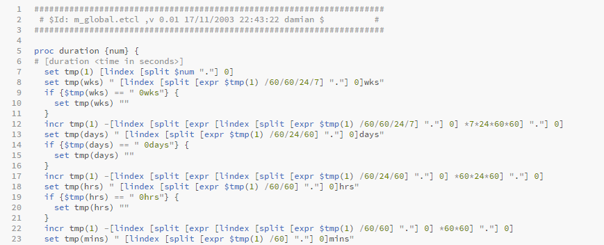

# Brackets.Tcl-Lang

_Version: 1.0.0

### About
A very simple extension for [Brackets](http://brackets.io/) to allow Tcl syntax highlighting.

It will turn your coding into something readable, like so.

I have included .tcl and .etcl files, as I use .etcl to distinguish that they are for Eggdrop.